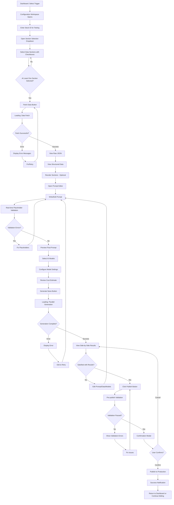
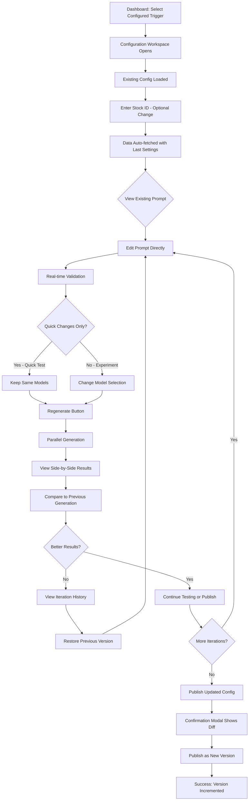
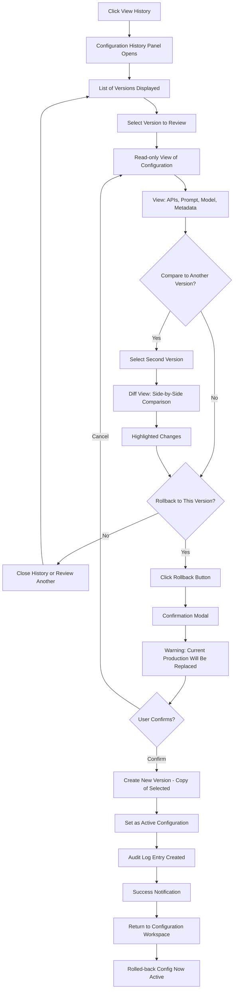

# AI-Powered News CMS for Equity Market Research UI/UX Specification

## Introduction

This document defines the user experience goals, information architecture, user flows, and visual design specifications for AI-Powered News CMS for Equity Market Research's user interface. It serves as the foundation for visual design and frontend development, ensuring a cohesive and user-centered experience.

The News CMS transforms content manager workflows from a rigid, developer-dependent process into an empowering, visual workspace. This specification guides the creation of an interface that balances sophisticated data handling with approachable clarity—no coding required.

### Multi-Audience Content Strategy

**Key Feature:** The CMS supports three independent prompt types (paid, unpaid, crawler) for different content distribution channels while maintaining a unified configuration interface:

- **💰 Paid Prompt** (always included): Content for paid subscribers with in-depth analysis
- **🆓 Unpaid Prompt** (optional): Content for free users with limited detail
- **🕷️ Web Crawler Prompt** (optional): SEO-optimized content for search engines and web crawlers

**Design Philosophy:**
- **Shared Components**: Data configuration, section management, and model selection apply to all prompt types (efficiency and consistency)
- **Separate Prompts**: Tabbed editor interface allows customizing prompt templates per type without duplication
- **Grouped Results**: Generation results organized by prompt type → model for clear comparison across different audiences
- **Type Selection Control**: Checkbox-based selection in Trigger Context Bar controls which prompt types are configured and tested

## Overall UX Goals & Principles

### Target User Personas

**1. Content Manager (Primary Persona)**
- Technical comfort: Moderate (understands JSON structure, familiar with AI concepts but doesn't code)
- Goals: Configure and optimize news generation workflows quickly, test multiple approaches, iterate without waiting for developers
- Pain points: Current system requires developer intervention for any change, no visibility into data driving generation, slow iteration cycles (days instead of hours)
- Context: Works in fast-paced market research environment, needs to respond quickly to changing market dynamics and content strategy

**2. Senior Analyst (Secondary Persona)**
- Technical comfort: High (comfortable with data structures, may have scripting experience)
- Goals: Deep control over prompts and data configuration, understand exactly what data feeds into AI generation, ensure accuracy and quality
- Pain points: Lack of transparency in current system, cannot verify data sources or test edge cases
- Context: Responsible for content quality, needs confidence that published configurations will perform well in production

**3. Content Team Lead (Tertiary Persona)**
- Technical comfort: Moderate to high
- Goals: Oversee configuration quality, review audit trails, manage team's configurations, ensure compliance
- Pain points: No visibility into who changed what, difficult to review configurations before production
- Context: Accountable for team output, needs governance and oversight capabilities

### Usability Goals

1. **Rapid Configuration**: New users can configure a basic trigger (select APIs, create prompt, test) within 30 minutes of first use
2. **Iteration Speed**: Experienced users can edit a prompt, regenerate with 2-3 models, and compare results in under 2 minutes
3. **Error Prevention**: Clear validation prevents publishing incomplete configurations; inline warnings catch data placeholder errors before generation
4. **Transparency**: Every step shows "what data am I working with" and "what will be sent to the AI"—no hidden magic
5. **Confidence Building**: Testing workflow (preview → generate → compare → iterate) ensures users trust configurations before publishing to production

### Design Principles

1. **Data Visibility First** - Always show the user what data is available and how it flows through the system. JSON should be readable, structured data clearly labeled, and previews abundant.

2. **Progressive Disclosure** - Start simple (trigger selection, stock ID), progressively reveal complexity (APIs → parsing → prompting → models). Don't overwhelm, but don't hide power-user features.

3. **Iterate, Don't Perfect** - Design for rapid iteration cycles. Make "edit → test → compare" feel instantaneous. Support experimentation over perfection on first try.

4. **Side-by-Side Comparison Everywhere** - Multi-model testing, historical versions, before/after changes—always show comparisons spatially (columns, split-panes) not sequentially.

5. **Trust Through Testing** - Publishing should feel confident because testing is thorough. Validation gates and "you've tested this" indicators build trust.

### Change Log

| Date | Version | Description | Author |
|------|---------|-------------|--------|
| 2025-10-27 | 1.0 | Initial UI/UX specification created | Sally (UX Expert) |
| 2025-10-28 | 2.0 | Updated Dashboard to dropdown selector; removed Audit Log and Settings from MVP scope | Sally (UX Expert) |
| 2025-10-28 | 2.1 | Updated Data Configuration: Changed from "Add API" pattern to multi-select dropdown with checkboxes for 14 hardcoded data sections. Updated user flows, component library, and interaction patterns accordingly. | Sally (UX Expert) |
| 2025-10-29 | 2.2 | Added multi-prompt type support (paid, unpaid, crawler) with tabbed editor interface; Added backend default selections for data sections; Updated Trigger Context Bar with status badges; Changed "Fetch Data" to "Use This Data" button; Updated Section Management to display only selected sections; Updated Results display to group by prompt type → model. | Sally (UX Expert) |
| 2025-11-03 | 2.3 | Reorganized workflow: Section selection moved to Data Configuration step with checkbox preview; "Use This Data" button navigates to Section Management; Section Management focuses on ordering only; OLD mode shows single section, NEW shows selected sections, OLD_NEW shows combined OLD + NEW sections for reordering. | Sally (UX Expert) |

## Information Architecture (IA)

### Site Map / Screen Inventory

```mermaid
graph TD
    A[Dashboard: Dropdown Trigger Selector] --> B[Configuration Workspace]

    A --> A1[Trigger Dropdown]
    A --> A2[Quick Stats Cards]
    A --> A3[Recent Activity List]

    B --> B1[Trigger Context Bar: Stock ID Input]
    B --> B2[Data Configuration Panel]
    B --> B3[Section Management Panel]
    B --> B4[Prompt Engineering Panel]
    B --> B5[Model Testing Panel]
    B --> B6[Results & Comparison Panel]

    B2 --> B2A[API Selection]
    B2 --> B2B[Raw JSON Display]
    B2 --> B2C[Structured Data Preview]

    B3 --> B3A[Section Reordering Interface]
    B3 --> B3B[Data Structure Preview]

    B4 --> B4A[Monaco Editor]
    B4 --> B4B[Placeholder Validation]
    B4 --> B4C[Prompt Preview Modal]

    B5 --> B5A[Model Selection Cards]
    B5 --> B5B[Settings & Cost Estimates]

    B6 --> B6A[Generation Status]
    B6 --> B6B[Side-by-Side Comparison]
    B6 --> B6C[Iteration History Timeline]

    B --> C[Publish Flow]
    C --> C1[Pre-Publish Validation]
    C --> C2[Confirmation Modal]
    C --> C3[Success State]

    B --> D[Configuration History]
    D --> D1[Version List Side-Drawer]
    D --> D2[Version Detail View]
    D --> D3[Diff Comparison]
    D --> D4[Rollback Confirmation]
```



### Navigation Structure

**Primary Navigation** (Top Navigation Bar - Bootstrap Navbar)
- **Dashboard** - Always accessible, returns to trigger selector (left side)
- **Configuration Workspace** - Context-dependent, shown when trigger selected
- **User Info** (right side) - Avatar/username display (non-interactive for MVP)

The primary navigation remains persistent across all views, providing clear orientation and quick access to major sections.

**Secondary Navigation** (Within Configuration Workspace - Vertical Tab/Accordion Pattern)
- **1. Data Configuration** (Collapsible panel)
  - Stock ID Input
  - Section Selection (Multi-select dropdown with checkboxes)
  - Fetch Data Button
  - Raw JSON View (per selected section)
  - Structured Data Preview (per selected section)
- **2. Section Management** (Collapsible panel)
  - Section Reordering Interface
  - Data Structure Preview
- **3. Prompt Engineering** (Collapsible panel - Primary workspace)
  - Monaco Editor (full-height)
  - Placeholder Validation Panel
  - Prompt Preview
  - Version History
- **4. Model Testing** (Collapsible panel)
  - Model Selection Checkboxes
  - Settings (Temperature, Tokens)
  - Cost Estimates
- **5. Results & Comparison** (Full-width panel when active)
  - Generation Status
  - Side-by-Side Output
  - Metadata Display

This secondary navigation follows a **vertical stepped workflow** that mirrors the logical progression: Data → Structure → Prompt → Model → Results.

**Breadcrumb Strategy**
- **Pattern**: Dashboard > [Trigger Name] > [Current Panel]
- **Example**: Dashboard > Earnings Alert > Prompt Engineering
- **Placement**: Below primary navigation, above Configuration Workspace content
- **Behavior**: Clickable to return to parent levels; current panel highlighted but not clickable
- **Rationale**: Provides context when deep in configuration, supports non-linear navigation back to Dashboard

## User Flows

### Flow 1: Configure New Trigger (First-Time Setup)

**User Goal:** Set up a new news trigger from scratch, configure data sources, create a prompt, test with AI models, and publish to production.

**Entry Points:** Dashboard (clicking "Configure" on an unconfigured trigger)

**Success Criteria:** Configuration published to production with validation passed and at least one successful test generation completed.

#### Flow Diagram



#### Edge Cases & Error Handling:
- **Invalid Stock ID**: Validation error shown inline before allowing "Fetch Data"
- **No Sections Selected**: "Fetch Data" button disabled with tooltip: "Please select at least one data section"
- **Data Fetch Timeout/Failure**: Error displayed for failed sections; successful sections still show data; user can retry
- **Parser Script Error**: Clear error message with details; user can view raw JSON to debug
- **Placeholder Validation Failure**: Red underlines in editor with tooltips; cannot generate until fixed
- **LLM Generation Timeout**: Show timeout error for specific model; other models continue
- **Incomplete Configuration**: Publish button disabled with tooltip explaining missing requirements
- **Network Disconnection**: Toast notification; unsaved changes preserved in sessionStorage

**Notes:** This flow represents the "happy path" with major decision points and error recovery loops. First-time users should complete this in ~30 minutes (per usability goal).

---

### Flow 2: Iterate and Refine Existing Configuration

**User Goal:** Quickly test prompt variations on an already-configured trigger to improve news quality.

**Entry Points:** Dashboard (clicking "Configure" on a configured trigger)

**Success Criteria:** New prompt tested, results compared to previous version, and optionally published as new version.

#### Flow Diagram



#### Edge Cases & Error Handling:
- **Unsaved Changes Warning**: If user tries to leave workspace with unpublished changes, show confirmation dialog
- **Iteration History Full**: Limit to last 10 iterations in session; older ones still accessible in Configuration History
- **Generation Slower Than Expected**: Show progress indicator; allow continuing to edit while waiting
- **Cost Exceeds Budget**: Warning modal if cumulative test costs exceed threshold

**Notes:** This flow optimizes for the 2-minute iteration goal—edit → regenerate → compare. Power users will use this flow frequently.

---

### Flow 3: Review and Rollback Configuration

**User Goal:** Review historical configuration versions and rollback to a previous version if current production config is problematic.

**Entry Points:** Configuration Workspace → "View History" button, or Dashboard → "History" icon on trigger

**Success Criteria:** Previous configuration version restored as active production configuration.

#### Flow Diagram



#### Edge Cases & Error Handling:
- **No Previous Versions**: History shows "No previous versions" message; rollback unavailable
- **Rollback Conflicts**: If selected version references APIs no longer available, show warning with missing APIs listed
- **Permission Denied**: Team Lead role required for rollback; error shown if insufficient permissions
- **Concurrent Modification**: If another user published new version during rollback flow, show conflict warning

**Notes:** This flow emphasizes safety—multiple confirmation steps and clear visibility into what will change. Content Team Leads will use this for governance.

## Wireframes & Mockups

**Primary Design Files:** Design files will be created in Figma (or similar tool) for high-fidelity mockups and prototyping. Link to be added once design files are created.

### Key Screen Layouts

#### Screen 1: Dashboard (Dropdown Trigger Selector)

**Purpose:** Primary landing page that enables users to select a news trigger for configuration and view system-wide activity and statistics.

**Key Elements:**
- **Top Navigation Bar** (Bootstrap Navbar):
  - Left: Logo, "Dashboard" link (active)
  - Right: User avatar + name (display only)
- **Page Header**:
  - Title: "News Trigger Dashboard" (H2, 32px, semi-bold, dark)
  - Subtitle: "Configure and manage AI-powered news generation triggers" (16px, secondary gray)
  - Margin-bottom: 32px
- **Trigger Selector Section** (centered, 600px width, white card with shadow):
  - Container: Background white, border-radius 8px, padding 32px, centered
  - Label: "Select Trigger to Configure" (18px, medium weight, margin-bottom 16px)
  - **Dropdown Field** (width 100%, height 48px):
    - Placeholder: "Choose a trigger..."
    - Border: 1px solid #ced4da, border-radius 4px
    - Font: 16px regular
  - **Dropdown Options** (shown when opened):
    - Each item: Trigger name + status badge (inline right-aligned)
    - Example: "Earnings Alert" with green "Configured" badge
    - Example: "Price Target Update" with gray "Unconfigured" badge
    - Example: "Market Commentary" with yellow "In Progress" badge
    - Item height: 56px, hover background #f8f9fa
  - **Configure Button**: "Configure Selected Trigger" (primary blue, full width, 48px height, disabled if no selection)
- **Quick Stats Section** (centered, 1200px width, 48px margin-top from selector):
  - Three stat cards (equal width, 16px gap):
    - Card 1: "Total Triggers" (icon, count, label)
    - Card 2: "Configured" (checkmark icon, count, label)
    - Card 3: "Last Updated" (clock icon, relative time)
  - Each card: White background, border-radius 8px, padding 24px, shadow
- **Recent Activity Section** (centered, 1200px width, 32px margin-top):
  - Heading: "Recent Configuration Changes" (20px, medium, margin-bottom 16px)
  - Activity list: White card with table-like layout
  - Shows 5 recent entries: Timestamp | Trigger Name | User | Action (badge)
  - Each row: 48px height, border-bottom except last
- **Empty State**: Centered message with icon: "No triggers available. Contact administrator."
- **Loading State**: Centered Bootstrap Spinner with "Loading triggers..."

**Interaction Notes:**
- Dropdown opens on click, shows all triggers with inline status badges
- Status badge colors: success (green), secondary (gray), warning (yellow)
- Configure button enables only when trigger selected from dropdown
- Clicking configure navigates to Configuration Workspace with trigger ID in URL
- Quick stats cards are informational only (non-interactive)
- Recent activity items clickable to view details or navigate to trigger
- Responsive: 1200px sections center-aligned on larger screens, full-width on smaller

**Design File Reference:** `figma.com/file/[project-id]/Dashboard-Dropdown-Selector` (to be created)

---

#### Screen 2: Configuration Workspace (Multi-Panel Layout)

**Purpose:** The primary working environment where users configure data sources, edit prompts, test AI models, and view results. This is the most complex screen and supports the majority of user workflows.

**Key Elements:**

**Layout Structure** (Bootstrap Grid - 12 column system):
- **Top Section** (full-width):
  - Breadcrumb: Dashboard > [Trigger Name] > [Current Panel]
  - **Trigger Context Bar** (new design with prompt type selection):
    - **Top Row**: Trigger name + metadata | Stock ID input field | Configuration status badge
    - **Bottom Row**: Prompt type selection checkboxes (Paid 💰 [always checked, disabled], Unpaid 🆓 [optional], Web Crawler 🕷️ [optional])
    - Status badges: "Configure Data" (gray) → "Fetching Data..." (cyan, spinner) → "Data Ready for [STOCK]" (green, checkmark) → "Configuration Error" (red, warning)
    - Stock ID auto-triggers data fetch on blur (500ms debounce)
    - Checked prompt types control which tabs appear in Prompt Editor

- **Left Sidebar** (3 columns, fixed, collapsible):
  - Vertical navigation/accordion for workflow steps:
    1. Data Configuration (expandable)
    2. Section Management (expandable)
    3. Prompt Engineering (expandable) ← Primary focus
    4. Model Testing (expandable)
    5. Results & Comparison (expandable)
  - Each item shows completion indicator (checkmark icon when valid)

- **Main Content Area** (9 columns, scrollable):
  - **Panel 1: Data Configuration** (when active):
    - **Purpose**: Fetch/generate data and allow users to SELECT which sections to use (selection happens here, ordering happens in Section Management)
    - **Info Callout** (if no stock ID): "Enter a Stock ID above to fetch data for testing" (yellow warning background)

    - **Step 1: Data Mode Selection** (completed in Trigger Context Bar, displayed here as context)
      - Shows selected mode badge: OLD | NEW | OLD_NEW

    - **Step 2: Data Fetch/Generation**:
      - **OLD Mode**: "Fetch Data" button → Retrieves existing trigger data from news_triggers collection
      - **NEW Mode**: "Generate Complete Report" button → Generates all 14 sections using structured_report_builder
      - **OLD_NEW Mode**: "Generate NEW Report" button → Fetches OLD data + generates NEW data
      - Loading state: Spinner with status message (e.g., "Generating report... 8-15 seconds")
      - Cached data indicator: "Cached data available for this stock ID" (success alert)

    - **Step 3: Data Preview with Section Selection**:

      **OLD Mode**:
      - Shows OldDataDisplay component with fetched trigger data (read-only JSON view)
      - Info alert: "This entire data structure will be treated as one section"
      - **"Use This Data" button** (always enabled once data fetched)
        - Width: 300px, primary blue, checkmark icon
        - Click action: Navigates to Section Management tab

      **NEW Mode**:
      - Shows NewDataDisplay component with all 14 generated sections
      - **Section Selection UI with Checkboxes**:
        - Each section shows: Checkbox | Section number badge | Section title | Expand/collapse button
        - Checkbox interaction: Click to select/deselect section
        - Visual highlight: Selected sections have blue border and light blue background
        - **View Toggle Buttons** (top toolbar):
          - "All Sections" button (shows all 14 sections)
          - "Selected Only" button (filters to show only checked sections)
        - **Bulk Selection Buttons** (top toolbar):
          - "Select All" button
          - "Clear All" button
        - Selected count indicator: "X sections selected" (updates dynamically)
      - **"Use This Data (X sections)" button**:
        - Only enabled when selections > 0
        - Width: 300px, primary blue, checkmark icon
        - Shows count: "Use This Data (5 sections)"
        - Click action: Navigates to Section Management tab with selected sections

      **OLD_NEW Mode**:
      - Shows two panels side-by-side or stacked:
        1. **OLD Data (Preview)**: OldDataDisplay component (read-only)
        2. **NEW Generated Data - Select Sections**: NewDataDisplay with checkboxes (same as NEW mode)
      - Info alert: "Select which NEW sections to use. In Section Management, you'll arrange OLD data and NEW sections together."
      - **"Use This Data (OLD + X NEW sections)" button**:
        - Only enabled when NEW selections > 0
        - Width: 350px, primary blue, checkmark icon
        - Shows count: "Use This Data (OLD + 3 NEW sections)"
        - Click action: Navigates to Section Management tab

    - **Data Persistence**: Uses localStorage/sessionStorage to cache generated data by stock ID (avoids regeneration on stock ID re-entry)

  - **Panel 2: Section Management** (when active):
    - **Purpose**: Arrange the ORDER of sections using drag-and-drop (receives ALREADY SELECTED sections from Data Configuration)
    - **Description**: "Drag and drop sections below to control their order in the final output."
    - **Info Alert**: Shows guidance based on data mode:
      - OLD: "The entire OLD data structure is treated as one section. No reordering needed."
      - NEW: "Drag and drop sections to set their order in the final output."
      - OLD_NEW: "Arrange the order of OLD data section and NEW sections. Drag OLD section anywhere in the list to position it relative to NEW sections."

    - **Display Logic by Data Mode**:

      **OLD Mode**:
      - Shows single section in SectionManagementPanel component
      - Section item: `{id: 'old_data', name: 'OLD Data (Complete)', source: 'old'}`
      - Drag handle disabled (read-only, no reordering needed)
      - Source badge: Blue "OLD" badge (#0dcaf0 / info variant)
      - Info callout: "No reordering needed. Proceed to configure prompts."

      **NEW Mode**:
      - Shows only the selected NEW sections (passed from Data Configuration)
      - Example: If user selected sections 1, 3, 5, 9, 12 → shows 5 draggable items
      - Each section displays:
        - Drag handle icon (6 dots vertical grip) - ENABLED
        - Section number badge (e.g., "1", "3", "5")
        - Section name (e.g., "Company Information", "Annual Income Statement")
        - Source badge: Green "NEW" badge (#198754 / success variant)
      - Drag-and-drop enabled using React Beautiful DnD or React DnD
      - Section count indicator: "Section Order (5 sections)"

      **OLD_NEW Mode**:
      - Shows OLD section + selected NEW sections in one combined draggable list
      - **Initial Order**: OLD section first, then NEW sections in their selected order
      - Example display:
        ```
        [1] 🔵 OLD Data (Complete) [drag handle]
        [2] 🟢 Section 1: Company Information [drag handle]
        [3] 🟢 Section 5: Cash Flow Statement [drag handle]
        [4] 🟢 Section 9: Stock Price Analysis [drag handle]
        ```
      - **ALL sections are draggable** - user can move OLD section anywhere in the list
      - Drag interaction: Can reorder to achieve any arrangement (e.g., Section 1 → OLD Data → Section 5 → Section 9)
      - Section count indicator: "Section Order (1 OLD + 3 NEW sections)"
      - **Reordering preserves source information**: State tracks final order while maintaining source tags

    - **Drag-and-Drop Interaction**:
      - Hover state: Light gray background on drag handle hover
      - Dragging state: Item becomes semi-transparent, placeholder shows drop target
      - Drop animation: Smooth transition to new position
      - Keyboard support: Arrow keys + Space for accessibility

    - **Action Buttons**:
      - **"Reset Order" button**: Resets to default order (OLD first if OLD_NEW, otherwise original selection order)
      - **"Preview Data Structure" button**: Opens modal showing JSON structure with final ordered sections
      - Buttons positioned at bottom of panel

    - **Warning if No Selections**:
      - NEW/OLD_NEW modes: If no sections selected in Data Configuration, show warning alert
      - Message: "No sections selected yet. Please go back to Data Configuration and select sections to use."
      - Section Management panel remains empty until selections made

    - **Data Persistence**:
      - Uses React state management to track section order
      - State passed to Prompt Engineering step for placeholder generation
      - localStorage keys: `sectionOrder_{triggerId}` stores final ordered section IDs

  - **Panel 3: Prompt Engineering** (when active - PRIMARY PANEL):
    - **Tabbed Interface for Multi-Prompt Type Support**:
      - **Top Toolbar** (96px height, light gray background):
        - **Top Row**: Title "Prompt Template" | Auto-save indicator "Saved 2 minutes ago" | Undo/Redo buttons | Preview button | History button
        - **Bottom Row**: Horizontal tabs for prompt types (only checked types from Trigger Context Bar shown)
          - Tab 1: 💰 **Paid** (always visible, blue underline when active)
          - Tab 2: 🆓 **Unpaid** (shown only if checked in Context Bar)
          - Tab 3: 🕷️ **Web Crawler** (shown only if checked in Context Bar)
        - Active tab: Blue underline (2px), blue text, white background
        - Inactive tabs: Gray text, transparent background, hover state
        - Tab icons for visual clarity: 💰 Paid, 🆓 Unpaid, 🕷️ Crawler
        - Tab validation indicators: Warning icon if prompt has errors
    - **Monaco Editor** (switches content based on active tab):
      - Full height (~600px minimum)
      - Syntax highlighting for placeholders ({{variable}})
      - Line numbers, search/replace, keyboard shortcuts
      - Each prompt type has independent template and undo/redo stack
      - Auto-save every 5 seconds (debounced) per prompt type
      - Word/character count per prompt type
    - **Placeholder Validation Panel** (below or side-by-side):
      - Real-time validation for currently active tab only
      - Invalid placeholders underlined in red with tooltips
      - Autocomplete suggestions when typing {{
      - Validation error summary panel with clickable errors
      - List of errors with line numbers
    - **"Preview Final Prompt" button** → opens modal with substituted prompt for selected tab
      - Modal can show tabs to preview all checked prompt types if desired

  - **Panel 4: Model Testing** (when active):
    - **Header Label**: "(Used for All Types)" - indicates shared configuration
    - Model cards grouped by provider (OpenAI, Anthropic, Google)
    - Each model: checkbox, name, settings (temperature slider, max tokens input), cost estimate per model
    - **Cost Calculation**: Total estimated cost = (selected models × checked prompt types)
      - Example display: "2 models × 3 prompt types (paid, unpaid, crawler) = 6 generations total"
      - Breakdown shown: "Estimated total cost: $0.45 for 6 generations"
    - Visual indicator: "Will generate for: Paid, Unpaid, Crawler" based on checked types in Context Bar
    - Help tooltips explain temperature and max tokens for non-technical users
    - "Generate News" button (large, primary, bottom):
      - Triggers generation for selected models across all checked prompt types
      - Disabled if no model selected or no valid prompts

  - **Panel 5: Results & Comparison** (when active - FULL WIDTH, 9 columns):
    - **Hierarchical Display: Prompt Type → Models**
    - **Generation Status**: Real-time status indicators grouped by prompt type, then by model (Pending, Generating, Complete, Failed)
    - Progress indicator: "Generating 4 of 6 complete" (updates during parallel generation)

    **For Each Prompt Type Group** (collapsible sections):

    - **Group 1: 💰 Paid Prompt Results** (colored header: blue #0d6efd):
      - Side-by-side columns (2-3 models, Bootstrap Columns)
      - Each model column: Model name header | generated news text (card) | metadata footer
      - Metadata per result: 🎯 Tokens: 456 | ⏱️ Time: 8.3s | 💰 Cost: $0.08 (actual values after generation)
      - Columns aligned vertically for easy visual comparison within this prompt type
      - "Copy" button per result

    - **Group 2: 🆓 Unpaid Prompt Results** (colored header: green #198754):
      - Same layout as Group 1 (side-by-side model columns)
      - Shows results for Unpaid prompt across selected models
      - Metadata displayed per result

    - **Group 3: 🕷️ Web Crawler Prompt Results** (colored header: orange #fd7e14):
      - Same layout (side-by-side model columns)
      - Shows results for Crawler prompt across selected models
      - Metadata displayed per result

    - **Responsive Design**: 2-3 columns on desktop (1200px+), single column (stacked) on tablet (768-1199px)
    - Visual indicators for outliers within each prompt type group: longest/shortest output, highest/lowest cost, fastest/slowest generation
    - Failed generations show error message clearly indicating which type and model failed
    - Results remain visible while editing prompt for iterative refinement

    - **Bottom Actions**:
      - "Regenerate" button (regenerates for currently checked prompt types and selected models)
      - Iteration History timeline (collapsible, below results) - shows what changed between iterations including which prompt types were tested

**Bottom Actions Bar** (sticky, full-width):
- "Save Draft" button (secondary)
- "View History" button (secondary)
- "Publish" button (primary, large, disabled until validation passes)

**Interaction Notes:**
- Left sidebar items collapse/expand on click; only one primary panel active at a time
- "Fetch Data" transforms Data Configuration panel from compact to expanded view
- Monaco Editor auto-saves every 5 seconds (debounced)
- Generate button shows loading spinner and disables during API calls
- Results panel appears dynamically after first generation; pushes other panels up
- Sticky actions bar remains visible during scrolling

**Design File Reference:** `figma.com/file/[project-id]/Configuration-Workspace` (to be created)

---

#### Screen 3: Publish Confirmation Modal

**Purpose:** Provides final validation and confirmation before publishing configuration for all prompt types to production, ensuring users understand what will change and preventing accidental deployments.

**Key Elements:**
- **Modal Header** (Bootstrap Modal): "Publish Configuration to Production"
- **Validation Checklist** (read-only):
  - **Shared Configuration:**
    - ✓ APIs configured (list names)
    - ✓ Section order defined
    - ✓ Model selected
    - ✓ Stock ID validated
  - **Per Prompt Type:**
    - ✓ 💰 Paid prompt created and tested
    - ✓ 🆓 Unpaid prompt created and tested (if checked)
    - ✓ 🕷️ Crawler prompt created and tested (if checked)
  - Warning icon if any concerns (e.g., "Last test was 2 hours ago - consider re-testing" or "Paid prompt changed without re-testing")
- **Configuration Summary**:
  - Trigger name
  - Selected data sections (bulleted list with section numbers and names)
  - Section order
  - Selected Model and settings (applies to all prompt types)
  - **Per Prompt Type** (expandable sections):
    - **💰 Paid Prompt** (blue header):
      - Prompt preview (truncated, 3-4 lines with "Expand" button)
      - Character count
      - Last tested: timestamp
    - **🆓 Unpaid Prompt** (green header, if checked):
      - Same layout as Paid
    - **🕷️ Crawler Prompt** (orange header, if checked):
      - Same layout as Paid
- **Diff View** (if updating existing config):
  - Side-by-side comparison: Current Production vs. New Configuration
  - Highlighted changes per prompt type (green for additions, red for removals, yellow for modifications)
  - Shows which prompt types have changed
- **Warning Message** (if applicable): "This will replace the current production configuration for all prompt types (paid, unpaid, crawler). Previous version will remain in history."
- **Actions**:
  - "Cancel" button (secondary, left)
  - "Publish to Production" button (primary, danger color, right)
  - Success notification after publish: "Published successfully with 3 prompt types as Version X.X"

**Interaction Notes:**
- Modal cannot be dismissed by clicking backdrop (must use Cancel button)
- "Publish to Production" button requires confirmation (no accidental clicks)
- After publish, modal shows success state briefly then closes
- Success state: Checkmark icon, "Published successfully as Version X.X", "View Published Config" link

**Design File Reference:** `figma.com/file/[project-id]/Publish-Modal` (to be created)

---

#### Screen 4: Configuration History (Side-Drawer Overlay)

**Purpose:** Allows users to review previous configuration versions, compare changes, and rollback if needed without leaving the Configuration Workspace context.

**Key Elements:**
- **Side-Drawer** (Bootstrap Offcanvas, slides from right, 40% viewport width):
  - Header: "Configuration History" title, Close button
  - **Version List** (scrollable):
    - Each version: Version number (e.g., "v1.3"), timestamp, published by (user), "Active" badge (if current)
    - Click to expand: Shows summary (APIs, model, prompt snippet)
  - **Selected Version View** (replaces list when version clicked):
    - Read-only display of full configuration
    - Tabs: Overview, Prompt, Data Sources, Model Settings
    - Action buttons: "Compare with Another Version", "Rollback to This Version", "Back to List"
  - **Diff Comparison View** (when comparing):
    - Side-by-side: Version A vs. Version B
    - Highlighted differences (same color scheme as Publish modal)
    - "Close Comparison" button

**Interaction Notes:**
- Drawer stays open while navigating between versions (persistent state)
- Rollback button shows confirmation modal (similar to Publish modal) with warning
- Can close drawer and return to Workspace at any time without losing Workspace state
- "Active" badge on current production version is prominent (primary color)

**Design File Reference:** `figma.com/file/[project-id]/Configuration-History` (to be created)

## Component Library / Design System

**Design System Approach:** The application will use **Bootstrap 5** as the foundational design system, implemented via **React-Bootstrap** components. This approach provides a proven, accessible component library with minimal custom styling needed, reducing development time while maintaining a professional appearance.

**Rationale:** Bootstrap 5 offers comprehensive responsive utilities, well-tested accessibility features, and a familiar component set that aligns with the PRD's technical requirements. React-Bootstrap provides React-native components avoiding jQuery dependencies and integrating seamlessly with Next.js.

**Customization Strategy:** Utilize Bootstrap's Sass variables for theme customization (colors, spacing, typography) while maintaining Bootstrap's core structure. Custom components only where Bootstrap doesn't provide needed functionality (Monaco Editor integration, drag-and-drop lists).

### Core Components

#### Component: Button

**Purpose:** Primary interaction element for all actions throughout the application.

**Variants:** Primary, Secondary, Danger, Success, Link

**States:** Default, Hover, Active, Disabled, Loading (with spinner)

**Usage Guidelines:**
- Primary buttons for single primary action per screen section
- Use `btn-lg` for important CTAs (Generate, Publish)
- Include loading spinner (Bootstrap Spinner) for async operations
- Disabled state with tooltip explanation when action unavailable

---

#### Component: Card

**Purpose:** Container for grouping related content, used extensively for data sections, results, and informational displays.

**Variants:** Standard Card, Interactive Card (hover), Collapsible Card, Status Card (colored border)

**States:** Default, Hover, Expanded/Collapsed, Selected

**Usage Guidelines:**
- Use for Quick Stats cards, structured data sections, model results, activity lists
- Include status badges in header for state indication
- Card footer for metadata (timestamps, authors, actions)
- Maintain consistent padding with Bootstrap spacing utilities

---

#### Component: Modal

**Purpose:** Focused overlays for confirmations, previews, and important decisions.

**Variants:** Confirmation Modal, Preview Modal (large), Info Modal (read-only)

**States:** Hidden, Visible, Loading

**Usage Guidelines:**
- Always include explicit close button in header
- Use `.modal-dialog-scrollable` for long content
- Confirmation modals: Primary action on right, Cancel on left
- Prevent backdrop dismiss for critical confirmations

---

#### Component: Form Controls

**Purpose:** Data input elements for configuration and settings.

**Variants:** Text Input, Select Dropdown, Range Slider, Checkbox, Switch

**States:** Default, Focus, Valid, Invalid, Disabled

**Usage Guidelines:**
- Always include labels (use Bootstrap `.form-label`)
- Show validation states with `.is-valid` / `.is-invalid` classes
- Provide helpful validation messages below inputs
- Use placeholders for format examples

---

#### Component: Dropdown (Select)

**Purpose:** Selection control for choosing from a list of options, prominently used for trigger selection on Dashboard and data section selection in Configuration Workspace.

**Variants:**
- Standard Dropdown (single selection)
- Large Dropdown (48px height)
- Searchable Dropdown
- Multi-Select Dropdown with Checkboxes (for data section selection)

**States:** Default, Open, Focus, Disabled, Loading

**Usage Guidelines:**
- Use for trigger selection (main Dashboard dropdown)
- Use for data section selection (Configuration Workspace - multi-select with checkboxes)
- Use for filters (Audit Log, Configuration Workspace)
- Include placeholder text when no selection made (e.g., "Choose a trigger...", "Choose sections...")
- Show status badges inline with option text for trigger selection
- For multi-select dropdowns: Show selected count badge in dropdown button (e.g., "3 sections selected")
- Dropdown items should have clear hover states (light gray background)
- Item height: 56px for primary dropdowns, 40px for filter dropdowns, 48px for checkbox items
- Support keyboard navigation (arrow keys, Space to check/uncheck, Escape to close)
- Large dropdowns (trigger selector) should be visually prominent with full-width button styling
- Multi-select dropdowns remain open during selection; close on outside click or Escape key
- Checkbox items: Checkbox on left, label on right, full-width clickable area

---

#### Component: Badge

**Purpose:** Status indicators and labels throughout the application.

**Variants:** Status Badges (success/secondary/warning/danger), Count Badges, Label Badges

**States:** Static (no interaction)

**Usage Guidelines:**
- Use semantic colors: success (green), danger (red), warning (yellow), secondary (gray)
- Keep text concise (single word or short phrase)
- Position in card headers or next to titles

---

#### Component: Toast Notifications

**Purpose:** Non-blocking feedback for user actions and system events.

**Variants:** Success Toast, Error Toast, Info Toast, Warning Toast

**States:** Hidden, Visible, Auto-dismissing

**Usage Guidelines:**
- Position: Top-right corner
- Auto-dismiss after 5 seconds for success/info, manual dismiss for errors
- Include icon indicating type
- Stack multiple toasts vertically

---

#### Component: Monaco Editor (Custom Integration)

**Purpose:** Full-featured code editor for prompt engineering with syntax highlighting.

**Variants:** Light Theme, Dark Theme

**States:** Default, Loading, Read-only, Error (validation failure)

**Usage Guidelines:**
- Minimum height: 600px for comfortable editing
- Enable line numbers, minimap for long prompts
- Syntax highlighting for placeholders (`{{variable}}`)
- Integrate with validation to show inline errors

---

#### Component: Table

**Purpose:** Tabular data display for audit logs, configuration history, and structured data listings.

**Variants:** Standard Table, Striped Table, Bordered Table, Hoverable Table, Sortable Table

**States:** Default, Loading (skeleton), Empty, Error

**Usage Guidelines:**
- Use Bootstrap Table component (`.table` class)
- Primary use: Audit Log (sortable, paginated, filterable)
- Secondary use: Recent Activity on Dashboard, Configuration metadata displays
- Table header: Light gray background (#f8f9fa), semi-bold text, border-bottom
- Table rows: 64px height for data-heavy tables, 48px for compact listings
- Hover state: Light gray background (#f8f9fa) for row highlighting
- Sortable columns: Show sort icon (up/down arrow) on header click
- Pagination: Show max 5 page numbers with Previous/Next buttons
- Empty state: Centered message with icon inside table container
- Loading state: Skeleton rows with shimmer animation
- Responsive: Horizontal scroll on small screens (maintain column widths)

---

#### Component: Tabs (for Prompt Types)

**Purpose:** Navigation between different prompt type editors (paid, unpaid, crawler) within the Prompt Engineering panel.

**Variants:** Active Tab, Inactive Tab, Tab with Warning

**States:** Default, Hover, Active, Disabled (Paid tab cannot be unchecked)

**Usage Guidelines:**
- Horizontal layout with consistent spacing (8px gap)
- Active tab: Blue underline (2px), blue text (#0d6efd), white background
- Inactive tabs: Gray text (#6c757d), transparent background
- Hover state: Light gray background (#f8f9fa) for inactive tabs
- Tab visibility controlled by checkbox selection in Trigger Context Bar
- Icons enhance recognition: 💰 Paid, 🆓 Unpaid, 🕷️ Crawler
- Warning icon indicator shown if validation errors exist in that tab's prompt
- Clicking tab switches Monaco Editor content to that prompt type's template

---

#### Component: Status Badge (for Trigger Context Bar)

**Purpose:** Visual indicator of data configuration state in Trigger Context Bar.

**Variants:** Configure Data (gray), Fetching Data (cyan with spinner), Data Ready (green with checkmark), Configuration Error (red with warning)

**States:** Static (animated for loading state)

**Usage Guidelines:**
- Position: Top-right of Trigger Context Bar
- Badge sizes: 14px font, padding 6px 12px, border-radius 12px
- Icon + text layout (icon 12px, left of text, 4px margin-right)
- Color-coded for quick recognition:
  - Gray (#6c757d): Initial "Configure Data" state
  - Cyan (#0dcaf0): "Fetching Data..." with animated spinner
  - Green (#198754): "Data Ready for [STOCK]" with checkmark icon
  - Red (#dc3545): "Configuration Error" with warning triangle
- Subtext showing current stock ID in "Data Ready" state
- Updates automatically based on workflow state

---

#### Component: Prompt Type Checkbox

**Purpose:** Selection control for enabling/disabling prompt types in Trigger Context Bar.

**Variants:** Checked and Disabled (Paid), Checked, Unchecked

**States:** Default, Hover, Checked, Disabled

**Usage Guidelines:**
- 20px square checkbox with Bootstrap styling
- Icon + text + optional badge layout
- Paid prompt: Always checked, disabled (cannot be unchecked), shows "Default" badge
- Unpaid and Crawler prompts: Optional, can be checked/unchecked
- Checking/unchecking controls tab visibility in Prompt Editor panel
- Consistent spacing: Icon (16px) 8px → Checkbox (20px) 8px → Text (14px) 8px → Badge (if applicable)
- Full row is clickable for better UX (not just the checkbox)

---

### Custom Components

For functionality not provided by Bootstrap, the following custom components will be developed:

1. **Drag-and-Drop Section List**: For section reordering (using React DnD) - dynamically shows only selected sections from Data Configuration
2. **Side-by-Side Diff Viewer**: For configuration comparison (Monaco Editor diff mode) - supports multi-prompt type diffs
3. **Cost Estimator Display**: Real-time cost calculation widget - calculates (models × prompt types) for total estimate
4. **Iteration History Timeline**: Visual timeline of generation attempts - tracks which prompt types were tested in each iteration
5. **Stat Card**: Quick stats display on Dashboard (icon, count, label layout)
6. **Activity List Item**: Recent activity row component with timestamp, user, action badge
7. **Tabbed Monaco Editor**: Monaco Editor with tab switching for multi-prompt type support - maintains separate undo/redo stacks per tab
8. **Grouped Results Display**: Hierarchical results view showing prompt type groups (colored headers) → model columns (side-by-side comparison)

## Branding & Style Guide

### Visual Identity

**Brand Guidelines:** This is an internal tool for the equity market research platform. Corporate branding should be minimal and non-intrusive, prioritizing functionality and readability over brand expression.

**Logo Usage:**
- Company logo placed in top-left of navigation bar (navbar-brand)
- Logo should link to Dashboard (standard web convention)
- Size: ~40px height, maintain aspect ratio
- Logo may be replaced with text-only brand name if logo not available

**Application Name:** "News CMS" or company-specific name to be determined

### Color Palette

| Color Type | Hex Code | Usage |
|------------|----------|-------|
| Primary | `#0d6efd` | Primary buttons, active states, links, Paid prompt type (Bootstrap default blue) |
| Secondary | `#6c757d` | Secondary buttons, inactive elements, borders (Bootstrap gray) |
| Success | `#198754` | Configured status, success messages, validation checkmarks, Unpaid prompt type |
| Warning | `#ffc107` | In-progress status, caution messages, cost warnings |
| Danger | `#dc3545` | Error states, destructive actions, validation errors |
| Info | `#0dcaf0` | Info messages, help tooltips, data preview accents, "Fetching Data" status |
| **Orange** | `#fd7e14` | **Web Crawler prompt type** headers and indicators |
| Light | `#f8f9fa` | Panel backgrounds, card backgrounds, subtle divisions |
| Dark | `#212529` | Text, headings, dark mode elements |
| Neutral Gray Scale | `#e9ecef`, `#dee2e6`, `#ced4da` | Borders, dividers, disabled states |

**Prompt Type Color Scheme:**
- 💰 Paid: Primary Blue (#0d6efd)
- 🆓 Unpaid: Success Green (#198754)
- 🕷️ Web Crawler: Orange (#fd7e14)

### Typography

#### Font Families

- **Primary:** System font stack: `-apple-system, BlinkMacSystemFont, "Segoe UI", Roboto, "Helvetica Neue", Arial, sans-serif`
- **Secondary:** Same as primary
- **Monospace:** `SFMono-Regular, Menlo, Monaco, Consolas, "Liberation Mono", "Courier New", monospace`

#### Type Scale

| Element | Size | Weight | Line Height |
|---------|------|--------|-------------|
| H1 | 2.5rem (40px) | 300 (light) | 1.2 |
| H2 | 2rem (32px) | 300 (light) | 1.2 |
| H3 | 1.75rem (28px) | 400 (normal) | 1.3 |
| H4 | 1.5rem (24px) | 400 (normal) | 1.4 |
| Body | 1rem (16px) | 400 (normal) | 1.5 |
| Small | 0.875rem (14px) | 400 (normal) | 1.4 |
| Tiny | 0.75rem (12px) | 400 (normal) | 1.3 |

### Iconography

**Icon Library:** Bootstrap Icons (https://icons.getbootstrap.com/)

**Usage Guidelines:** Use icons to reinforce meaning, not replace text labels (except for common actions). Icon sizes: 16px (small), 24px (default), 32px (large). Common icons include check-circle, x-circle, exclamation-triangle, info-circle, gear, clock, plus-circle, trash, and pencil.

### Spacing & Layout

**Grid System:** Bootstrap 12-column grid with responsive breakpoints (xs: <576px, sm: ≥576px, md: ≥768px, lg: ≥992px, xl: ≥1200px, xxl: ≥1400px)

**Spacing Scale:** Bootstrap spacing utilities (0-5 scale)
- `3`: 1rem (16px) - Standard spacing for most use cases
- Apply `.mb-3` or `.mb-4` between sections
- Use `.p-3` or `.p-4` for card padding

## Accessibility Requirements

### Compliance Target

**Standard:** Basic web accessibility following standard HTML practices. WCAG AA/AAA certification is **not required** for MVP as this is an internal tool for a small, specialized user group (content managers and analysts).

### Key Requirements

#### Visual

**Color contrast ratios:** Bootstrap's default color palette meets WCAG AA standards. Minimum 4.5:1 ratio for normal text, 3:1 for large text. Avoid color as the only means of conveying information.

**Focus indicators:** Bootstrap's default focus outlines must be preserved. Visible focus indicator on all interactive elements. Focus order follows logical tab sequence.

**Text sizing:** Base font size 16px, allow browser zoom up to 200% without loss of functionality. Use rem units for responsive text scaling.

#### Interaction

**Keyboard navigation:** All interactive elements accessible via keyboard. Modal dialogs trap focus when open. Drag-and-drop section list provides keyboard alternative (number input for reordering).

**Screen reader support:** Semantic HTML elements, ARIA labels for icon-only buttons, ARIA live regions for dynamic updates, form labels associated with inputs.

**Touch targets:** Minimum 44x44px for primary actions (Bootstrap default). Adequate spacing between interactive elements.

#### Content

**Alternative text:** All informational images require alt text. Decorative images use empty alt attribute.

**Heading structure:** Proper heading hierarchy (H1 → H2 → H3, no skipping levels). One H1 per page.

**Form labels:** All form inputs have associated visible labels. Error messages linked to inputs via `aria-describedby`. Required fields indicated with text.

### Testing Strategy

**Manual Testing:** Keyboard-only navigation through critical workflows, test browser zoom at 150% and 200%, verify tab order and focus visibility.

**Automated Testing:** Run Lighthouse accessibility audit (aim for 90+ score), use axe DevTools browser extension, ESLint with jsx-a11y plugin.

**Deferred to Post-MVP:** Full WCAG AA compliance audit, comprehensive screen reader testing, accessibility documentation for end users.

## Responsiveness Strategy

### Breakpoints

| Breakpoint | Min Width | Max Width | Target Devices | Primary Use |
|------------|-----------|-----------|----------------|-------------|
| Desktop (xl) | 1200px | - | Desktop monitors (1920x1080, 1366x768) | **Primary target** - Full multi-panel layout |
| Large Desktop (xxl) | 1400px | - | Large monitors (2560x1440+) | Enhanced spacing, more side-by-side content |
| Tablet (md) | 768px | 1199px | iPad, Surface (landscape) | **Secondary target** - Stacked panels, usable with scrolling |
| Small Tablet (sm) | 576px | 767px | Small tablets, phablets | Minimal support - Single column, limited functionality |
| Mobile (xs) | - | 575px | Smartphones | **Out of scope** - Display message: "Please use desktop or tablet" |

### Adaptation Patterns

#### Layout Changes

**Desktop (1200px+):** 3-column sidebar + 9-column main content. Side-by-side model comparison (2-3 models). Dashboard with 3-column trigger card grid. Monaco Editor full width with minimap.

**Tablet (768px-1199px):** 12-column stacked layout (sidebar becomes top accordion). Results with 2 models side-by-side OR stacked. Dashboard with 2-column card grid. Monaco Editor full width, minimap hidden.

**Mobile (< 768px):** Display message: "For the best experience, please access this application on a desktop or tablet device (minimum 768px width)."

#### Navigation Changes

**Desktop:** Full horizontal navbar with all links visible. Breadcrumbs on single line. Sidebar navigation always visible.

**Tablet:** Navbar collapses to hamburger menu. Breadcrumbs may wrap. Sidebar converts to horizontal accordion tabs.

#### Content Priority

**Desktop:** All content visible with minimal scrolling. Multi-panel layout. Side-by-side comparisons prioritized.

**Tablet:** Essential workflow prioritized (Stock ID, Prompt Editor, Model Selection, Results). Advanced features require scrolling. Side-by-side comparisons limited to 2 models or stacked.

#### Interaction Changes

**Desktop:** Hover states, drag-and-drop for section reordering, multi-select with Ctrl/Cmd+Click.

**Tablet:** Tap interactions (44px minimum touch targets), drag-and-drop with number input alternative, touch-friendly sliders.

## Animation & Micro-interactions

### Motion Principles

**Purposeful Motion:** Every animation serves a functional purpose—providing feedback, guiding attention, or smoothing transitions. Avoid animation for decoration only.

**Subtle & Fast:** Animations should be quick (150-300ms) and subtle to maintain perceived performance.

**Respect User Preferences:** Honor `prefers-reduced-motion` media query for users who prefer minimal animation.

**Consistent Timing:** Use consistent easing functions and durations across similar interactions.

### Key Animations

- **Loading States**: Spinner rotates continuously (Bootstrap `.spinner-border`, continuous duration, linear)
- **Button Feedback**: Scale down on click, color change on hover (150ms, ease-out)
- **Toast Notifications**: Slide in from top-right, pause, slide out (300ms in, 5s pause, 300ms out, ease-in-out)
- **Modal Open/Close**: Fade in with backdrop, scale 90% to 100% (200ms, ease-out)
- **Accordion Expand/Collapse**: Smooth expand/collapse (250ms, ease-in-out)
- **Card Hover Elevation**: Shadow increases on hover (200ms, ease-out)
- **Form Validation**: Border color change, validation icon fade (150ms, ease-in)
- **Drag-and-Drop Feedback**: Dragged item follows cursor with opacity reduction, drop zone highlights (continuous during drag, 200ms drop)

### Micro-interactions

- **Focus Indicators**: 2px solid blue outline on keyboard focus
- **Copy Button**: Icon changes from copy → checkmark, text "Copy" → "Copied!" (150ms, revert after 2s)
- **Auto-save Indicator**: "Saving..." text fades in/out near editor (200ms fade, visible 1s)
- **Disabled Button Tooltip**: Tooltip explains why button disabled on hover (200ms fade in)
- **Error Shake**: Input/modal shakes horizontally on validation failure (300ms, 3 shakes)

### Animation Performance

Use GPU-accelerated properties (`transform`, `opacity`) for animations. Avoid animating `width`, `height`, `left`, `top`. Implement `prefers-reduced-motion` media query to disable animations for users who prefer reduced motion.

## Performance Considerations

### Performance Goals

- **Page Load**: Initial page load under 2 seconds (NFR1)
- **API Response**: Data fetching completes within 5 seconds per API call (NFR2)
- **LLM Generation**: News generation responses within 30 seconds, model-dependent (NFR3)
- **Interaction Response**: UI interactions respond within 100ms for perceived instant feedback
- **Animation FPS**: Maintain 60fps for all animations and scrolling

### Design Strategies

**Code Splitting and Lazy Loading:**
- Next.js automatic code splitting per page
- Dynamic imports for Monaco Editor (load only when Configuration Workspace accessed)
- Lazy load modals on-demand
- Route-based splitting reduces initial bundle by 40-60%

**State Management Optimization:**
- React Context API with separate contexts for isolated concerns
- Memoization for expensive components (Monaco Editor, side-by-side results)
- Debounced auto-save (5 seconds) prevents excessive writes
- Optimistic UI updates show immediate feedback

**API Call Optimization:**
- Batch parallel API calls (Promise.all)
- Data caching persists in React state for session duration
- Request debouncing for stock ID validation
- SSE or Polling for lightweight generation status checks

**Bundle Size Management:**
- Target: <200KB initial bundle, <300KB Workspace bundle, <800KB total (gzipped)
- Tree shaking removes unused code
- Avoid heavy dependencies (no jQuery, Lodash, Moment.js)
- Import only used Bootstrap components

**Rendering Performance:**
- Virtualized lists for >50 items (react-window)
- Pagination for audit logs (50 entries per page)
- CSS containment on independent components
- RequestAnimationFrame for custom animations maintains 60fps

**Monitoring:**
- Lighthouse CI for automated performance audits
- Track Core Web Vitals: LCP <2.5s, FID <100ms, CLS <0.1
- Performance API for critical user flow timing

## Next Steps

### Immediate Actions

1. **Stakeholder Review and Approval** - Share specification with PM, Tech Lead, and Content Team. Target: 1 week review cycle.

2. **Create High-Fidelity Design Mockups** - Set up Figma project, create pixel-perfect mockups for all key screens, design system documentation, interactive prototype. Target: 2-3 weeks.

3. **Design Review and Iteration** - Present mockups, conduct usability review with 2-3 content managers, gather feedback, iterate. Target: 1 week.

4. **Prepare for Frontend Architecture Phase** - Design Architect reviews specification alongside PRD, creates technical architecture document. Target: 1-2 weeks (parallel with mockups).

### Design Handoff Checklist

- [ ] All user flows documented and approved
- [ ] Component inventory complete
- [ ] Accessibility requirements defined
- [ ] Responsive strategy clear with breakpoint specifications
- [ ] Performance goals established and aligned with PRD NFRs
- [ ] Brand guidelines incorporated
- [ ] High-fidelity mockups created for all key screens
- [ ] Interactive prototype demonstrates core workflows
- [ ] Design system documented
- [ ] Edge cases and error states designed
- [ ] Loading states and animations specified
- [ ] Design assets exported and organized

### Post-MVP Design Enhancements

1. **Enhanced Data Visualization** - Charts for cost tracking, visual diff highlighting, performance analytics
2. **Advanced Interaction Patterns** - Keyboard shortcuts, bulk operations, template system
3. **Personalization** - User preferences, recently used triggers, favorites
4. **Accessibility Enhancements** - WCAG AA compliance, high-contrast mode, screen reader optimization
5. **Collaboration Features** - Comments, approval workflow, real-time presence

### Success Metrics

**Usability:** Time to first config (<30 min), iteration time (<2 min), validation errors, completion without support

**Performance:** Page load (<2s), Core Web Vitals scores, user-reported satisfaction

**Adoption:** Active users, configs published per week, CMS usage vs. old system

**Satisfaction:** NPS, qualitative feedback, support ticket reduction

---

## Summary

This UI/UX specification defines a comprehensive design for the AI-Powered News CMS that empowers content managers to configure, test, and publish news generation workflows without developer dependency. The design prioritizes data visibility, rapid iteration, confidence through testing, professional simplicity with Bootstrap 5, and performance-first architecture.

### Key Features in Version 2.2

**Multi-Prompt Type Support** (Major Update):
- Three independent prompt types (💰 Paid, 🆓 Unpaid, 🕷️ Crawler) for different content distribution channels
- Tabbed editor interface allows customizing prompts per audience without duplication
- Shared data configuration, section management, and model selection across all types
- Grouped results display: Prompt Type → Models for clear cross-audience comparison
- Cost calculation accounts for all prompt types: (models × checked types) = total generations

**Enhanced Data Configuration Workflow**:
- Backend provides default section selections on page load (5 sections pre-checked)
- "Use This Data" button (replaces "Fetch Data") clarifies workflow progression
- Dynamic section count indicator: "5 sections selected" updates in real-time
- "Default configuration" badge indicates initial backend-selected state
- Enabled button by default since backend provides selections

**Improved Trigger Context Bar**:
- Two-row layout: Top (trigger info + stock ID + status badge) | Bottom (prompt type checkboxes)
- Status badges with icons: "Configure Data" → "Fetching Data..." → "Data Ready for [STOCK]" → "Configuration Error"
- Auto-fetch on Stock ID change (blur event, 500ms debounce)
- Prompt type checkboxes control tab visibility in Prompt Editor

**Dynamic Section Management**:
- Only displays sections selected in Data Configuration panel (no hardcoded 14-section list)
- Example: If 5 sections selected, only those 5 appear in reorderable list
- Section names dynamically pulled from selections

**Tabbed Prompt Editor**:
- Horizontal tabs (Paid | Unpaid | Crawler) with icons and color coding
- Active tab: Blue underline, blue text; Inactive: Gray text, hover state
- Each tab maintains independent template and undo/redo stack
- Validation per tab with warning indicators
- Auto-save every 5 seconds per prompt type

**Grouped Results Display**:
- Hierarchical view: Prompt Type Groups (collapsible) → Model Columns (side-by-side)
- Colored headers per type: Blue (Paid), Green (Unpaid), Orange (Crawler)
- Metadata per result: 🎯 Tokens | ⏱️ Time | 💰 Cost (actual values after generation)
- Visual outlier indicators within each group

**Publishing with Multi-Type Validation**:
- Validation checklist per prompt type (created and tested)
- Configuration summary shows all three prompt types with expandable sections
- Diff view highlights which prompt types changed
- Success message: "Published successfully with 3 prompt types as Version X.X"

The specification is ready for high-fidelity mockup creation and technical architecture design. With stakeholder approval, the design phase can begin immediately, targeting a 4-5 week timeline to design completion and handoff to development.

